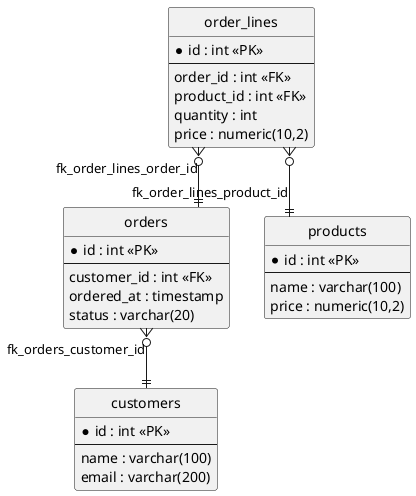
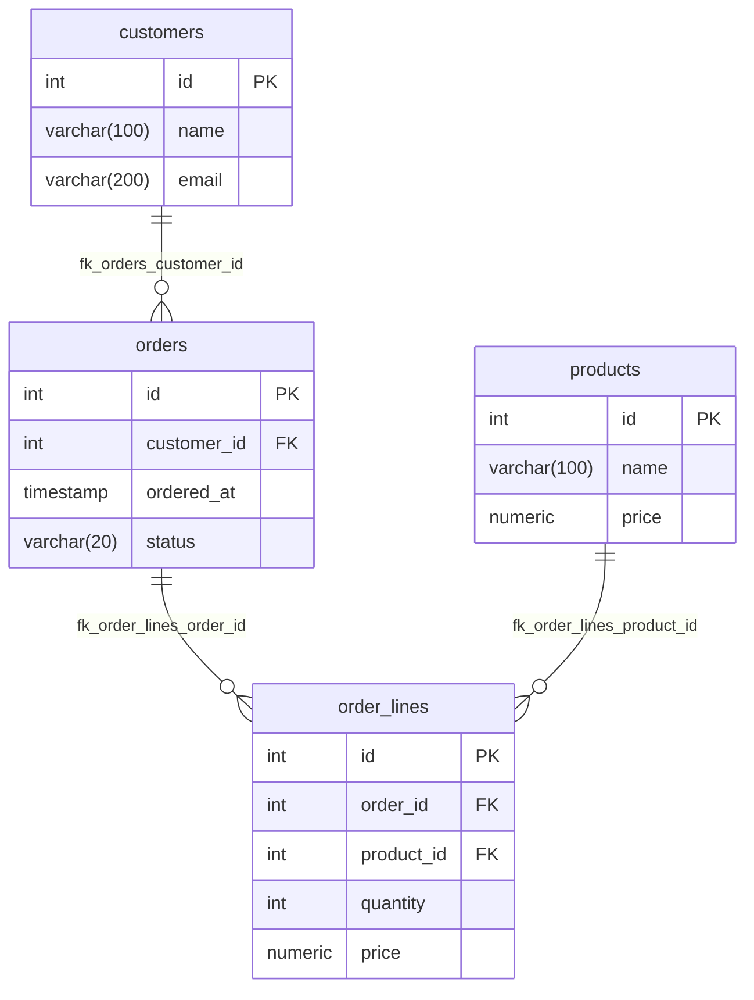

# eSQLManager

A graphical database manager written in Java Swing. It started in 2002 as a graduation project and has since been brought up to date: it builds with Maven, runs on Java 25 and talks to current database servers.


## Documentation

The user documentation is in [docs/](docs/index.md): [getting started](docs/getting-started.md), [tables and columns](docs/tables-and-columns.md), [SQL query](docs/query.md), [database designer](docs/designer.md) and [settings](docs/settings.md). The same Markdown pages are the help tab of the application.

## Features

Each database has its own dialect (`nl.errorsoft.esql.dialect`) that decides how a feature is carried out, so the same feature works on MySQL and PostgreSQL. SQL Server and Oracle only have the features that work through plain JDBC; they have not been tested against a live server recently.

| Feature | MySQL | PostgreSQL | SQL Server | Oracle |
|---|---|---|---|---|
| Saved connection profiles with auto-connect | yes | yes | yes | yes |
| Several connections open at once, tiled or cascaded | yes | yes | yes | yes |
| JDBC driver configuration | yes | yes | yes | yes |
| Browse databases, tables, views and columns in a tree | yes | yes | yes | yes |
| Schemas in the tree (server > databases > schemas > tables), create and drop a schema | no | yes | no | no |
| Row count per table | yes | yes | yes | yes |
| View table data, paged | yes | yes | yes | yes |
| Sort table data | yes | yes | yes | yes |
| Edit cell values | yes | yes | yes | yes |
| Insert rows | yes | yes | yes | yes |
| Delete rows | yes | yes | yes | yes |
| Upload and download binary data (blobs) | yes | yes | yes | yes |
| SQL query tabs with syntax highlighting, opening and saving .sql files | yes | yes | yes | yes |
| Run selection or the statement at the caret, run all statements of a script | yes | yes | yes | yes |
| Query results in tabs, one per statement, with time, database, rows and duration | yes | yes | yes | yes |
| Auto completion of keywords, tables and columns (aliases resolved) | yes | yes | yes | yes |
| Create a database | yes | yes | not verified | no |
| Drop a database | yes | yes | not verified | no |
| Create a table | yes | yes | no | no |
| Create table, Edit table and Indexes as tabs of the connection window | yes | yes | no | no |
| Modify a table (rename, comment, storage engine) | yes | yes | no | no |
| Drop a table | yes | yes | yes | yes |
| Empty a table | yes | yes | yes | yes |
| Add, modify and drop columns | yes | yes | no | no |
| Index manager (primary key, unique, index, fulltext) | yes | yes | no | no |
| Table maintenance: optimize, analyze | yes | yes (VACUUM, ANALYZE) | no | no |
| Table maintenance: check, repair | yes | no | no | no |
| Export as SQL (structure and data) | yes | yes | no | no |
| Import an SQL script | yes | yes | no | no |
| Database designer: draw a model and generate it | yes | yes | no | no |
| Designer foreign keys: drag from column to column, edit and generate | yes | yes | no | no |
| Designer context menus (canvas, tables, databases, notes) | yes | yes | yes | yes |
| Designer export as PlantUML and Mermaid | yes | yes | yes | yes |
| Designer: open an existing database (reverse engineering) with automatic layout | yes | yes | no | no |
| User manager: accounts and passwords | yes | yes (roles) | no | no |
| User manager: privileges per server, database and table | yes | yes | no | no |
| Process list, with ending a process | yes | yes | no | no |
| Server status | yes | yes | no | no |
| Server variables | yes | yes | no | no |
| Output panel with connection details and executed queries | yes | yes | yes | yes |
| Status bar with server, account and the last action | yes | yes | yes | yes |
| Appearance: follow the system, light, dark or native | yes | yes | yes | yes |
| Brand icons of the servers, the eSQL logo as window and Dock icon | yes | yes | yes | yes |
| In-app help: the Markdown pages of docs/ in a help tab | yes | yes | yes | yes |

The SQL query opens as a tab of the connection window ("Query", "Query 2", ...). Every statement that returns rows gets its own result tab below the editor, named after the statement (hover for the full text), with when it ran, on which database, the row count and the time taken; the newest is in front and at most 20 are kept. Shortcuts in the editor: Cmd+Enter (Ctrl+Enter on Windows and Linux) runs the selection or the statement at the caret, Cmd+Shift+Enter runs all statements in order and stops at the first error; Ctrl+Space, Cmd+Space and Cmd+Shift+Space (Ctrl+Shift+Space elsewhere) open the completion, typing a period after a table or alias opens its columns. macOS gives Cmd+Space to Spotlight; turn that shortcut off in System Settings > Keyboard > Keyboard Shortcuts > Spotlight to use it for completion.

Right click a server, database, table or column in the tree for its context menu. It only lists what the server supports: Users, Process list, Status and Variables on the server, Open in designer, Export and Import on a database, Edit, Indexes and the maintenance commands (Optimize and Analyze, plus Check and Repair on MySQL) on a table.

On PostgreSQL the tree is server > databases > schemas > tables: a database shows its schemas (`public` and the others, system schemas left out) and a schema its tables. A schema has its own menu (Reload tables, Create table, Open in designer, Export, Import, Drop schema), a database has Create schema and Reload schemas. PostgreSQL has no check and repair commands. A PostgreSQL connection is made to one database; opening another database in the tree reconnects. MySQL stays server > databases > tables.

Export and import work per schema: exporting a database takes every schema, the script names `schema.table` and creates missing schemas, and importing into a schema node puts unqualified tables there. The query tab has a schema picker next to the database (it sets the `search_path`).

Known gaps with schemas: the user manager grants table privileges without a schema, and Open in designer on a database node reads its current schema (use the schema node for another schema).

## Database designer

The designer (Tools > Database Designer) draws a model of databases, tables and notes and generates it on the server. Tables are cards with an icon per column (key for the primary key, link for a foreign key column), in the colours of the light or dark theme. Right click the canvas to add a database, table or note at that spot, select all, arrange or toggle the grid; right click a card or a connector for what applies to it.

* Drag from the icon of a column onto a column of another table to create a foreign key, or use "Add Foreign Key..." in the table's context menu or the Foreign Keys tab of its properties. The dialog takes several column pairs, a name (default `fk_<table>_<column>`) and the ON DELETE and ON UPDATE actions.
* Foreign keys are drawn from column to column with a crow's foot at the many side. Double click a line to edit it, select it and press Delete to remove it.
* Shift-drag links a table or a note to a database.
* "Open in designer" in the context menu of a database (or the toolbar button of the connection window) reads all tables of that database, views left out, with their columns, primary keys and foreign keys (composite keys too) into a new model. The tables are placed automatically with the layered algorithm of the [Eclipse Layout Kernel](https://eclipse.dev/elk/): a referenced table left of the tables that refer to it, tables without relations in a grid below. View > Arrange Automatically does the same for any model. The model can be saved as an .edm file; generating it on the same database skips the tables and keys that exist.
* File > Export as PlantUML... and Export as Mermaid... write the model as an ER diagram. For the shop model:





## Requirements

- Java 25
- Docker is only needed if you want a throwaway database to try it out

Maven is not required, the project includes the Maven wrapper.

## Run

```sh
./mvnw compile exec:exec
```

The application runs from the `runtime/` directory, which holds its configuration.

## Configuration

Everything the application reads and writes at runtime lives in `runtime/`:

| Path | Contents |
|---|---|
| `runtime/conf/profiles.xml` | Saved connection profiles |
| `runtime/conf/settings.xml` | Application settings |
| `runtime/conf/driver.xml` | JDBC driver class and URL per database type |
| `runtime/conf/datatypes.xml` | Column types |

Profiles are normally created in the connection dialog. When you choose a server type the default port and user name are filled in (MySQL 3306 / `root`, PostgreSQL 5432 / `postgres`, SQL Server 1433 / `sa`, Oracle 1521 / `system`).

The **Database(s)** field of a profile is an optional comma separated filter. Leave it empty to list every database on the server. For PostgreSQL the first name is also the database the connection is made to, with `postgres` as the default.

Note that `profiles.xml` stores passwords in plain text. Keep local changes out of version control, for example with `git update-index --skip-worktree runtime/conf/profiles.xml`.

### Appearance

Settings > Preferences > Appearance chooses the look and feel: follow the system (light or dark, on macOS), light, dark or the native look of the operating system. The choice is stored in `settings.xml` and applies at once. On macOS the menu is in the screen menu bar. The icons are vector icons from [Lucide](https://lucide.dev) that follow the theme. Profiles, connection windows, the window selector in the toolbar and the server node of the tree show the logo of the server (PostgreSQL, MySQL, Oracle, SQL Server, from [Devicon](https://devicon.dev) and [Simple Icons](https://simpleicons.org)).

## Logging

The application logs with Log4j 2. The configuration is `src/main/resources/log4j2.xml`: messages go to the console and to the output panel. Executed queries are logged at `debug` level, set the `nl.errorsoft.esql.jdbc` logger to `info` to hide them.

## Try it with a local PostgreSQL

```sh
./start.sh            # PostgreSQL 17 in Docker with a sample database "shop", then the application
./start.sh --db-only  # only the database
./stop.sh             # stop and remove the database container
```

The script prints what to fill in: server type **PostgreSQL**, host `localhost`, user `postgres`, password `test` and the port it prints. The container uses port 5432 when that is free and the next free port otherwise, so it also works next to another PostgreSQL.

## Development

```sh
./mvnw test
```

The tests start PostgreSQL 17 and MySQL 8 with Testcontainers, so they need Docker and are skipped without it. They run the same scenarios against every dialect: tables, columns, indexes, export and import, editing data, users and privileges, databases, server status and the process list.

Design decisions and the architecture are described in `CLAUDE.md`. Format the code with `./mvnw spotless:apply`.

## Project layout

```
src/main/java/nl/errorsoft/esql
  Main.java  starts the application
  table/ database/ export/ importer/ blob/ user/ designer/ query/
  connection/ server/ settings/
             one package per feature: data, service and repository, with
             control/ and ui/ below it for the controllers and Swing windows
  app/       main window, start up, the ApplicationContext
  ui/        Swing parts shared by features (icon/, table/, editor/, util/)
  jdbc/      the database connection and the repository base class
  dialect/   the per-database behaviour (mysql/, postgres/, sqlserver/, oracle/)
  error/     EsqlException and the ErrorHandler
  job/       progress reporting for long running jobs
src/main/resources   icons, images and log4j2.xml
docs/                user documentation (Markdown), also the in-app help
src/test/java        dialect tests against real servers
runtime/             configuration the application reads and writes
```

## Credits

Programming and design by S. Oudmaijer and J. Walgemoed (Errorsoft), 2002 to 2003.
