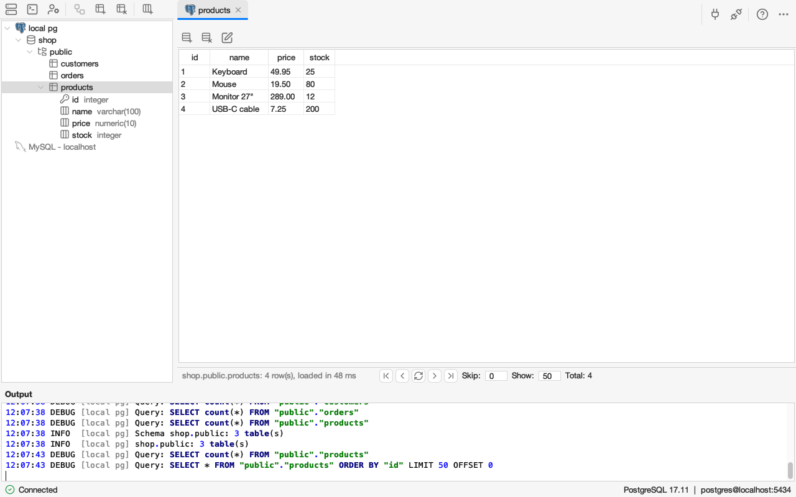
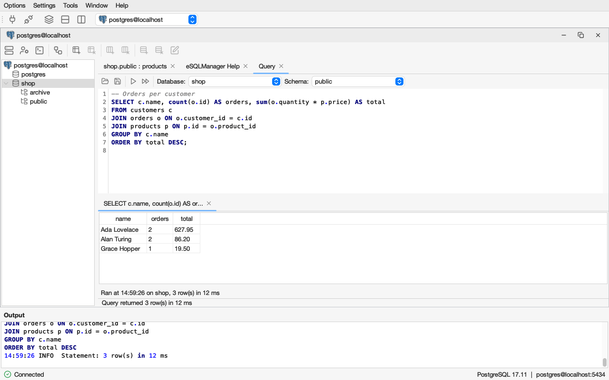
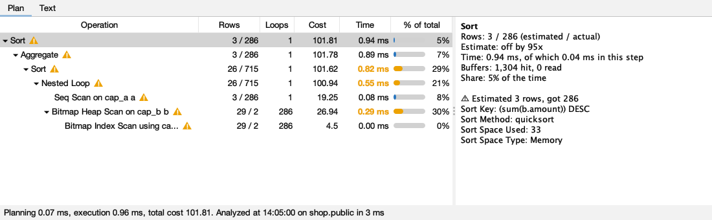
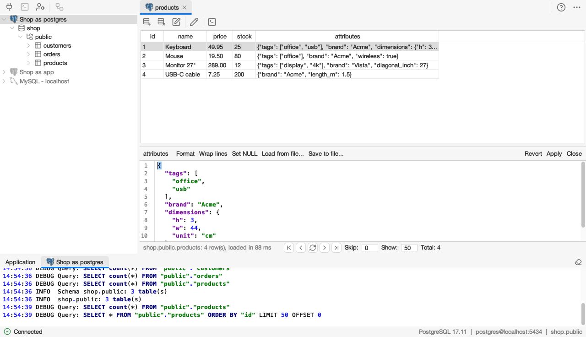
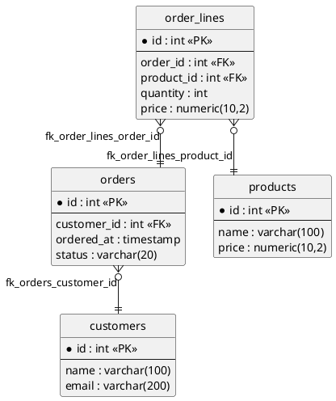
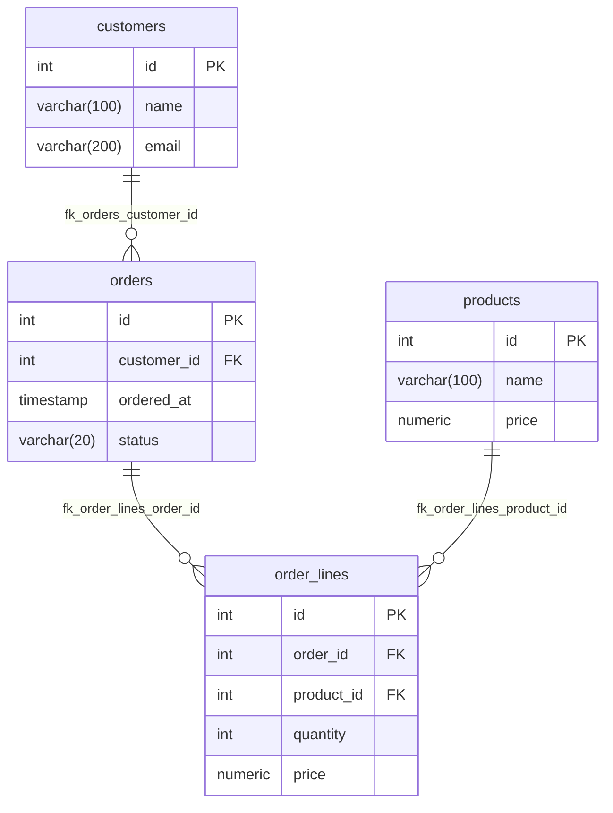

# eSQLManager

A graphical database manager written in Java Swing. It started in 2002 as a graduation project and has since been brought up to date: it builds with Maven, runs on Java 25 and talks to current database servers.

## Main features

### One explorer for all connections



Every open connection, and every saved profile in grey, is one tree: server, databases, schemas, tables and columns with their types, key and foreign key icons. Tables, queries, editors and designers open as tabs next to it, and each connection has its own output tab with the statements it ran.

### Query editor with completion



SQL highlighting, completion of keywords, tables and columns (aliases are resolved), run the statement at the caret or a whole script, one result tab per statement with time, rows and duration.

### Explain plans with hot spots



Explain and Explain analyze show the plan as a tree with rows, cost, time and the share of the total, mark the slowest steps and where the estimate was far off, from the editor or from any result tab.

### Cell value editor



Edit one value in a larger editor below the grid, with highlighting and formatting for JSON, XML and SQL, load a value from or save it to a file, upload and download binary data.

### Model designer


Draw a model of databases, tables and foreign keys and generate it on the server, or open an existing database to get its model back with an automatic layout. Export it as PlantUML or Mermaid.

### And more

* **MySQL and PostgreSQL**, with schemas on PostgreSQL. The MySQL and Oracle drivers are downloaded on first use, checked against a pinned checksum.
* Table maintenance, export and import of SQL scripts, user and privilege management, process list and server status, light and dark appearance.

## Documentation

The user documentation is in [docs/](docs/index.md): [getting started](docs/getting-started.md), [tables and columns](docs/tables-and-columns.md), [SQL query](docs/query.md), [database designer](docs/designer.md) and [settings](docs/settings.md). The same Markdown pages are the help of the application, a tab of its own in the window bar.

## Features

Each database has its own dialect (`nl.errorsoft.esql.dialect`) that decides how a feature is carried out, so the same feature works on MySQL and PostgreSQL. SQL Server and Oracle only have the features that work through plain JDBC; they have not been tested against a live server recently.

| Feature | MySQL | PostgreSQL | SQL Server | Oracle |
|---|---|---|---|---|
| Saved connection profiles with auto-connect, duplicate, optional saved password | yes | yes | yes | yes |
| Test connection from the profile dialog | yes | yes | yes | yes |
| Choose the databases and schemas a profile shows (checkbox tree in the profile dialog) | yes | yes | yes | no |
| Several connections open at once in one explorer, a tab per table, query, editor and designer, an output log tab per connection | yes | yes | yes | yes |
| JDBC driver configuration | yes | yes | yes | yes |
| Browse databases, tables, views and columns (with their types) in one explorer for all connections | yes | yes | yes | yes |
| Schemas in the tree (server > databases > schemas > tables), create, rename and drop a schema | no | yes | no | no |
| Row count per table | yes | yes | yes | yes |
| View table data, paged | yes | yes | yes | yes |
| Sort table data | yes | yes | yes | yes |
| Edit cell values | yes | yes | yes | yes |
| Insert rows | yes | yes | yes | yes |
| Delete rows | yes | yes | yes | yes |
| Upload and download binary data (blobs) | yes | yes | yes | yes |
| SQL query tabs with syntax highlighting, opening and saving .sql files | yes | yes | yes | yes |
| Run selection or the statement at the caret, run all statements of a script | yes | yes | yes | yes |
| Query results in tabs, one per statement, with time, database, rows and duration | yes | yes | yes | yes |
| Auto completion of keywords, tables and columns (aliases resolved) | yes | yes | yes | yes |
| Explain and explain analyze in a plan viewer: tree of steps, rows, cost, time, the hottest steps and hints | yes | yes | no | no |
| Create a database, with character set and collation (MySQL) or owner and encoding (PostgreSQL) | yes | yes | not verified | no |
| Drop a database | yes | yes | not verified | no |
| Create a table | yes | yes | no | no |
| Create table, Edit table and Indexes as tabs of the connection window | yes | yes | no | no |
| Modify a table (rename, comment, storage engine) | yes | yes | no | no |
| Drop a table | yes | yes | yes | yes |
| Empty a table | yes | yes | yes | yes |
| Rename and duplicate a table (with or without its data), read-only Properties of a table and a database | yes | yes | no | no |
| SQL preview in the table editor, comment per column | yes | yes | no | no |
| Add, modify and drop columns | yes | yes | no | no |
| Index manager (primary key, unique, index, fulltext) | yes | yes | no | no |
| Table maintenance: optimize, analyze | yes | yes (VACUUM, ANALYZE) | no | no |
| Table maintenance: check, repair | yes | no | no | no |
| Export as SQL (structure and data, views, IF EXISTS, batch INSERTs, encoding, .gz, transaction) | yes | yes (per schema) | no | no |
| Export: disable foreign key checks | yes | no | no | no |
| Import an SQL script (stop or continue on errors, single transaction, encoding, .gz) | yes | yes (into a schema) | no | no |
| Cancel a running export, import, upload or download | yes | yes | no | no |
| Schema picker in the query tab | no | yes | no | no |
| Database designer: draw a model and generate it, in a window on the desktop | yes | yes | no | no |
| Designer foreign keys: drag from column to column, edit and generate | yes | yes | no | no |
| Designer context menus (canvas, tables, databases, notes) | yes | yes | yes | yes |
| Designer export as PlantUML and Mermaid | yes | yes | yes | yes |
| Designer: open an existing database (reverse engineering) with automatic layout | yes | yes | no | no |
| User manager: accounts and passwords | yes | yes (roles) | no | no |
| User manager: privileges per server, database and table | yes | yes | no | no |
| Process list, with ending a process, pause, hide idle, interval and the full statement | yes | yes | no | no |
| Server status | yes | yes | no | no |
| Server variables | yes | yes | no | no |
| Output panel with connection details and executed queries | yes | yes | yes | yes |
| Status bar with server and account, a message bar per tab | yes | yes | yes | yes |
| Appearance: follow the system, light, dark or native | yes | yes | yes | yes |
| Preferences: editor font size, default folder and file encoding | yes | yes | yes | yes |
| Brand icons of the servers, the eSQL logo as window and Dock icon | yes | yes | yes | yes |
| In-app help: the Markdown pages of docs/ in a help tab of its own | yes | yes | yes | yes |

The SQL query opens as a tab of the connection window ("Query", "Query 2", ...). Every statement that returns rows gets its own result tab below the editor, named after the statement (hover for the full text), with when it ran, on which database, the row count and the time taken; the newest is in front and at most 20 are kept. The bar below the tabs shows the message of the tab in front (on a query tab only "Running...", a failed statement or the count of statements without rows, since each result tab has its own line; the rows loaded on the table data) and is empty for a tab without one, such as a fresh query tab. The tab in front has a darker background and a coloured underline. Shortcuts in the editor: Cmd+Enter (Ctrl+Enter on Windows and Linux) runs the selection or the statement at the caret, Cmd+Shift+Enter runs all statements in order and stops at the first error; Ctrl+Space, Cmd+Space and Cmd+Shift+Space (Ctrl+Shift+Space elsewhere) open the completion, typing a period after a table or alias opens its columns. macOS gives Cmd+Space to Spotlight; turn that shortcut off in System Settings > Keyboard > Keyboard Shortcuts > Spotlight to use it for completion.

The explorer on the left holds every open connection, named after its profile, and the saved profiles in grey (double click to connect). Every view opens as a tab on the right, the output panel across the bottom has an Application tab and a log tab per connection, each with Cmd/Ctrl+F to find text. Disconnecting closes the tabs of that connection and keeps its designers open. Selecting a node in the explorer only selects it; expanding it loads what is below it. Buttons and menu items that cannot run yet are disabled with a tooltip saying what is needed, those the server never offers are hidden. The table list of a database or schema (Show tables) has a toolbar for adding, opening, editing, dropping and maintaining its tables, several at once where that makes sense. Right click a connection, database, table or column in the explorer for its context menu. It only lists what the server supports: Users, Process list, Status and Variables on the server, Open in designer, Export, Import and Properties on a database, Edit, Indexes, Rename, Duplicate, Properties and the maintenance commands (Optimize and Analyze, plus Check and Repair on MySQL) on a table.

Export, import and the transfer of a binary cell run in the background with a progress window that has a Cancel button. The export window can wrap the script in a transaction, write views, several rows per `INSERT`, another encoding and gzip (a name ending in `.gz`); the import window can continue after errors and list the failed statements, or run everything in one transaction that is rolled back on an error or cancel.

On PostgreSQL the tree is server > databases > schemas > tables: a database shows its schemas (`public` and the others, system schemas left out) and a schema its tables. A schema has its own menu (Reload tables, Create table, Open in designer, Export, Import, Rename schema, Drop schema), a database has Create schema and Reload schemas. PostgreSQL has no check and repair commands. A PostgreSQL connection is made to one database; opening another database in the tree reconnects. MySQL stays server > databases > tables.

Export and import work per schema: exporting a database takes every schema, the script names `schema.table` and creates missing schemas, and importing into a schema node puts unqualified tables there. The query tab has a schema picker next to the database (it sets the `search_path`).

Known gaps with schemas: the user manager grants table privileges without a schema, and Open in designer on a database node reads its current schema (use the schema node for another schema).

## Database designer

The designer (Tools > Database designer) opens as a window on the desktop of eSQLManager, with a tab of its own next to the connection windows, one per model. It draws a model of databases, tables and notes and generates it on the server. Tables are cards with an icon per column (key for the primary key, link for a foreign key column), in the colours of the light or dark theme. Right click the canvas to add a database, table or note at that spot, select all, arrange or toggle the grid; right click a card or a connector for what applies to it.

* Drag from the icon of a column onto a column of another table to create a foreign key, or use "Add foreign key..." in the table's context menu or the Foreign Keys tab of its properties. The dialog takes several column pairs, a name (default `fk_<table>_<column>`) and the ON DELETE and ON UPDATE actions.
* Foreign keys are drawn from column to column with a crow's foot at the many side. Double click a line to edit it, select it and press Delete to remove it.
* Shift-drag links a table or a note to a database.
* "Open in designer" in the context menu of a database (or the toolbar button of the connection window) reads all tables of that database, views left out, with their columns, primary keys and foreign keys (composite keys too) into a new model. The tables are placed automatically with the layered algorithm of the [Eclipse Layout Kernel](https://eclipse.dev/elk/): a referenced table left of the tables that refer to it, tables without relations in a grid below. View > Arrange automatically does the same for any model. The model can be saved as an .edm file; generating it on the same database skips the tables and keys that exist.
* File > Export as PlantUML... and Export as Mermaid... write the model as an ER diagram. For the shop model:





## Download

Releases for macOS (Apple silicon, a dmg with its own Java runtime) are on https://github.com/sourcelabs-nl/esqlmanager/releases. The app is not signed: right click it in Applications and choose Open the first time, or run `xattr -dr com.apple.quarantine /Applications/eSQLManager.app`.

## Requirements

- Java 25
- Docker is only needed if you want a throwaway database to try it out

Maven is not required, the project includes the Maven wrapper.

## Run

```sh
./mvnw compile exec:exec
```

The application runs from the `runtime/` directory, which holds its configuration.

## Configuration

Everything the application reads and writes at runtime lives in `runtime/`:

| Path | Contents |
|---|---|
| `runtime/conf/profiles.xml` | Saved connection profiles |
| `runtime/conf/settings.xml` | Application settings |
| `runtime/conf/driver.xml` | JDBC driver class, URL and own driver jar per database type |
| `runtime/conf/datatypes.xml` | Column types |

### JDBC drivers

The PostgreSQL (BSD-2-Clause) and SQL Server (MIT) drivers are bundled. The MySQL driver (Connector/J, GPLv2 with the Universal FOSS Exception) and the Oracle driver (ojdbc11, Oracle Free Use Terms and Conditions) are not: the first connection to such a server asks to download the driver from Maven Central into `~/.esqlmanager/drivers` (also when running from source). The version and SHA-256 of each driver are pinned in `driver.DriverArtifact`; a file that does not match is deleted. Settings > JDBC driver settings shows the status per driver, has a Download button and accepts a driver jar of your own.

Profiles are normally created in the connection dialog, which lists the saved profiles at the left (add, remove and duplicate with the buttons above the list) and shows the selected one at the right. When you choose a server type the default port and user name are filled in (MySQL 3306 / `root`, PostgreSQL 5432 / `postgres`, SQL Server 1433 / `sa`, Oracle 1521 / `system`).


The connection dialog has a second tab, **Databases and schemas**, that is available after Test connection succeeded. Tick the databases (and on PostgreSQL the schemas) the profile should show; nothing ticked shows everything, and the first ticked database is the one the connection is made to (`postgres` by default). The selection is stored in `profiles.xml` as `<databases>db1,db2</databases>` plus an optional `<schemas><database name="db1"><schema>public</schema></database></schemas>`; a database without schema elements shows all its schemas. Unticked schemas are left out of the tree, the export and import windows, the query tab and the designer, but exporting a whole database still includes them, which the export window notes.

Note that `profiles.xml` stores saved passwords in plain text; switch off "Save password" in the profile to be asked for the password when connecting instead. Keep local changes out of version control, for example with `git update-index --skip-worktree runtime/conf/profiles.xml`.

### Preferences

Settings > Preferences holds the appearance (below), the font size of the SQL editors and the output panel (applies at once), the default folder that the export, import and file transfer windows start in, the default file encoding of the export and import windows, and whether the help opens at start. They are stored in `settings.xml`.

### Appearance

Settings > Preferences > Appearance chooses the look and feel: follow the system (light or dark, on macOS), light, dark or the native look of the operating system. The choice is stored in `settings.xml` and applies at once. On macOS the menu is in the screen menu bar. The icons are vector icons from [Lucide](https://lucide.dev) that follow the theme. Profiles, the window tabs and the server node of the tree show the logo of the server (PostgreSQL, MySQL, Oracle, SQL Server, from [Devicon](https://devicon.dev) and [Simple Icons](https://simpleicons.org)).

## Logging

The application logs with Log4j 2. The configuration is `src/main/resources/log4j2.xml`: messages go to the console and to the output panel. Executed queries are logged at `debug` level, set the `nl.errorsoft.esql.jdbc` logger to `info` to hide them.

## Try it with a local PostgreSQL

```sh
./start.sh            # PostgreSQL 17 in Docker with a sample database "shop", then the application
./start.sh --db-only  # only the database
./stop.sh             # stop and remove the database container
```

The script prints what to fill in: server type **PostgreSQL**, host `localhost`, user `postgres`, password `test` and the port it prints. The container uses port 5432 when that is free and the next free port otherwise, so it also works next to another PostgreSQL.

## Building a distribution

Two Maven profiles build an application that runs without a Java installation (the build itself needs a JDK 25 with `jlink` and `jpackage`):

```
./mvnw -Pjlink package -DskipTests      # target/runtime-image, a JDK with only the modules the application needs
./mvnw -Ppackage package -DskipTests    # target/dist/eSQLManager.app (macOS), builds the runtime image when missing
./mvnw -Ppackage package -DskipTests -Djpackage.type=dmg    # target/dist/eSQLManager-1.0.0.dmg
```

`-Djpackage.type` can also be `pkg`, `exe`, `msi`, `deb` or `rpm`, each needs the packaging tools of its platform. The scripts are `src/package/jlink.sh` and `src/package/jpackage.sh` (sh, so macOS and Linux). The macOS icon is made from `icons/logo.svg` with `rsvg-convert` and `iconutil`; without them the default Java icon is used.

Sizes on macOS (Apple silicon, JDK 25): runtime image 59 MB (19 modules), application image `eSQLManager.app` 78 MB.

The MySQL and Oracle drivers are not in the distribution, they are downloaded on first use (see JDBC drivers above).

The installed application keeps `conf/` and `credits.txt` in `~/.esqlmanager`, copied from the bundled `runtime/` on first start, so profiles and settings survive an update and the application folder can stay read-only.

## Development

```sh
./mvnw test
```

The tests start PostgreSQL 17 and MySQL 8 with Testcontainers, so they need Docker and are skipped without it. They run the same scenarios against every dialect: tables, columns, indexes, export and import, editing data, users and privileges, databases, server status and the process list.

Design decisions and the architecture are described in `CLAUDE.md`. Format the code with `./mvnw spotless:apply`; `./mvnw verify` checks the formatting and runs the tests.

### Conventions

The rules for contributions are written down as project skills: [`.claude/skills/esql-architecture`](.claude/skills/esql-architecture/SKILL.md) holds the layering, dialect, SQL safety and naming rules (A1-A8, N1-N6) and [`.claude/skills/esql-ui`](.claude/skills/esql-ui/SKILL.md) the Swing rules (U1-U8). The `/review` skill in Claude Code checks a change against both.

## Project layout

```
src/main/java/nl/errorsoft/esql
  Main.java  starts the application
  table/ database/ exporter/ importer/ blob/ user/ designer/ query/
  connection/ server/ settings/
             one package per feature: data, service and repository, with
             control/ and ui/ below it for the controllers and Swing windows
  app/       main window, start up, the ApplicationContext
  ui/        Swing parts shared by features (icon/, table/, editor/, dialog/, component/, util/)
  jdbc/      the database connection and the repository base class
  dialect/   the per-database behaviour (mysql/, postgres/, sqlserver/, oracle/)
  error/     EsqlException and the ErrorHandler
  job/       progress reporting for long running jobs
src/main/resources   icons, images and log4j2.xml
docs/                user documentation (Markdown), also the in-app help
src/test/java        dialect tests against real servers
runtime/             configuration the application reads and writes
```

## License

eSQLManager is free to use, also commercially. All other rights are reserved: copying, forking, modifying or redistributing it, or building a derivative or a re-implementation of it (also with AI tools), and using it as AI training material, needs the written permission of the author. See [LICENSE](LICENSE).

The third-party libraries (FlatLaf, RSyntaxTextArea and AutoComplete, ELK, JSVG, commonmark, Log4j, Guava, the PostgreSQL and SQL Server JDBC drivers) and the icons stay under their own licenses, listed in [NOTICE.txt](NOTICE.txt). The MySQL and Oracle JDBC drivers are not included; they are downloaded on first use under their own licenses.

## Credits

Programming and design by S. Oudmaijer and J. Walgemoed (Errorsoft), 2002 to 2003.
