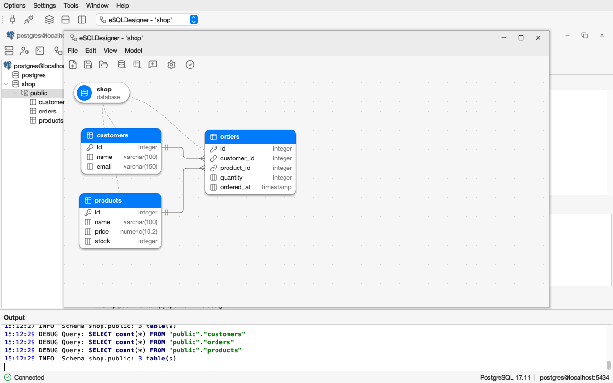

# Database designer

[Back to the help index](index.md)

Tools > Database Designer draws a model of databases, tables and notes, and generates it on a MySQL or PostgreSQL server. The designer opens as a window on the desktop of eSQLManager, next to the connection windows; the window selector in the toolbar lists it, so you can switch between a connection and its models. Each model has its own designer window. Closing it (or disconnecting its connection) asks to save the model first.



## Drawing a model

* Right click the canvas to add a database, a table or a note at that spot, to select all, to arrange the model or to show the grid.
* Right click a card for what applies to it: properties, add a foreign key, attach, remove.
* Double click a table to edit its name, columns and foreign keys.
* Shift-drag from a table or a note to a database to link them.
* Tables are cards with an icon per column: a key for the primary key, a link for a foreign key column. The colours follow the light or dark appearance.

## Foreign keys

* Drag from the icon of a column onto a column of another table, use "Add Foreign Key..." in a table's context menu, or the Foreign Keys tab of its properties.
* The dialog takes one or more column pairs, a name (default `fk_<table>_<column>`) and the ON DELETE and ON UPDATE actions. It checks that the columns exist and their types fit.
* A foreign key is drawn from column to column, with a crow's foot at the many side and a double bar at the referenced table. Double click a line to edit it, select it and press Delete to remove it.
* On MySQL foreign keys need InnoDB tables.

## Opening an existing database

"Open in designer" in the context menu of a database (or the designer button of the toolbar) reads every table of that database, views left out, with its columns, primary key, indexes and the foreign keys between them, into a new model. On PostgreSQL the database reads its current schema (normally `public`) and a schema node reads that schema; generating the model creates the tables in the current schema. The tables are placed automatically: a referenced table left of the tables that refer to it, tables without relations in a grid below. View > Arrange Automatically does the same for any model. On PostgreSQL a database node reads its current schema; use Open in designer on a schema node for another schema.

## Saving and generating

* File > Save Model writes the model to an `.edm` file, Open Model reads it back.
* Generating a model creates its databases, tables and foreign keys on the server. Tables and keys that exist are skipped, so a model can be generated again after adding to it.

## PlantUML and Mermaid

File > Export as PlantUML... and Export as Mermaid... write the model as an ER diagram text, for documentation or a README. For example in Mermaid:

```
erDiagram
    customers {
        int id PK
        varchar(100) name
    }
    orders {
        int id PK
        int customer_id FK
    }
    customers ||--o{ orders : "fk_orders_customer_id"
```
