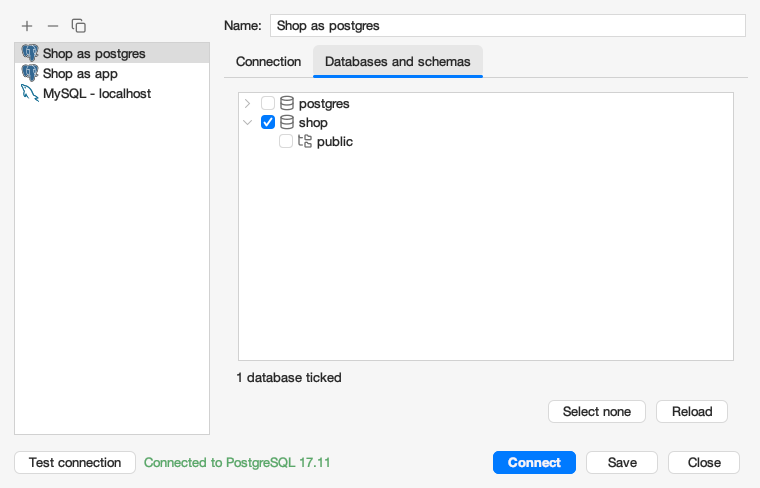

# Getting started

[Back to the help index](index.md)

## Connecting

Options > Connect (or the Connect button of the toolbar) opens the connection dialog. At the left is the list of saved profiles with three buttons above it: **+** makes a new profile (it is in the list as "New profile" until you save it), **-** removes the selected profile after asking, and the copy button duplicates it as "<name> copy" (no auto connect). Select a profile to edit it; when it has unsaved changes you are asked to save or discard them before another profile is shown. At the right are the **Name** of the profile and two tabs. The **Connection** tab holds the settings of a profile:

| Field | Meaning |
|---|---|
| Server type | MySQL, PostgreSQL, SQL Server or Oracle. Choosing one fills in the default port and user (MySQL 3306 / `root`, PostgreSQL 5432 / `postgres`). |
| Host and port | Where the server runs. |
| User and password | The account to log in with. |
| Save password | On by default. When it is off the password is not written to `conf/profiles.xml` and is asked for when you connect (also for auto connect). |
| Auto connect | Connect with this profile when the application starts. |

**Test connection** connects with the values in the form (the saved profile is not used) and shows "Connected to <server> <version>" in green or the error in red next to the button, without opening a window. A long message is cut off; hover over it to read all of it.

The first time you test or connect to a MySQL or Oracle server, eSQLManager asks to download its JDBC driver: these drivers are not included because of their licences (see [JDBC drivers](settings.md#jdbc-drivers)). PostgreSQL and SQL Server work without a download.

The **Databases and schemas** tab is available after a successful test. It lists the databases of the server with a checkbox (click the box or press the space bar); on PostgreSQL a database opens to show its schemas, which are loaded when you open it. Tick what the profile should show: nothing ticked shows everything, a ticked database without ticked schemas shows all its schemas, ticking a schema ticks its database, and unticking a database forgets its schemas. The first ticked database is the one the connection is made to (`postgres` when nothing is ticked). **Select none** clears the ticks, **Reload** lists the databases again. Changing the host, port, user, password or server type disables the tab until you test again; the ticks are kept. A ticked database that no longer exists is dropped when you save. Schemas that are not ticked are left out of the tree, the export and import windows, the query tab and the designer, but exporting a whole database still includes them.

**Save** keeps the profile in the list (also when you changed its name), **Connect** opens a connection with the values in the form and **Close** closes the dialog.

Profiles are saved in `conf/profiles.xml`. A saved password is stored there in plain text, so only save one on a machine you trust, or turn Save password off.

Several connections can be open at the same time. Each connection window, and each designer, has a tab at the top of eSQLManager with the logo of its server and its title; click a tab to bring that window to the front, or use Window > Next window and Previous window (Cmd/Ctrl+Shift+] and [) or pick it from the Window menu. The cross on a tab (or a middle click) closes the window: a connection asks "Disconnect from ...?", a designer asks to save its model.

## The connection window

* **Tree** on the left: the server, its databases, their tables and the columns of each table. On PostgreSQL a database holds schemas, which hold the tables. Double click a database to list its tables, double click a table to open its data. Right click any node for its context menu, which only lists what the server supports:
  * server: Create database, New query, Users, Process list, Show status, Show variables, Reload databases;
  * database: Open, Create table, Open in designer, Export, Import, Drop database, Properties, Reload tables (PostgreSQL: Create schema and Reload schemas);
  * schema (PostgreSQL): New query, Create table, Open in designer, Export, Import, Rename schema, Drop schema, Reload tables;
  * table: Open, Edit table, Indexes, Add field, Rename table, Duplicate table, Export, the maintenance commands, Empty table, Drop table, Properties, Reload columns;
  * column: Add field, Edit field, Drop field.
* **Tabs** on the right: the table list or the table data in the first tab, query tabs ("Query", "Query 2", ...). Every tab has a close button; the tab in front has a darker background and a coloured underline.
* **Toolbar**: create and drop a table, add and delete a field, insert, update and delete a row, run an SQL query, open the database in the designer, the user manager and refresh the tree. Buttons are enabled when they apply to what is selected.
* **Output panel** at the bottom: the log of the connection, with the server version and driver and every executed statement.

Closing the window asks "Disconnect from ...?" first.

## Status bars

* The bar below the tabs shows the message of the tab in front: on the table data how many rows were loaded and how long it took, on a query tab the outcome of its last run. A tab without a message of its own, such as a fresh query tab, leaves it empty. While the table data is in front, the paging buttons are in the same bar. What happens in the tree (schemas listed, a model opened in the designer) is in the output panel.
* The status bar of the application shows a light for the state of the active connection and, on the right, its server and account.
